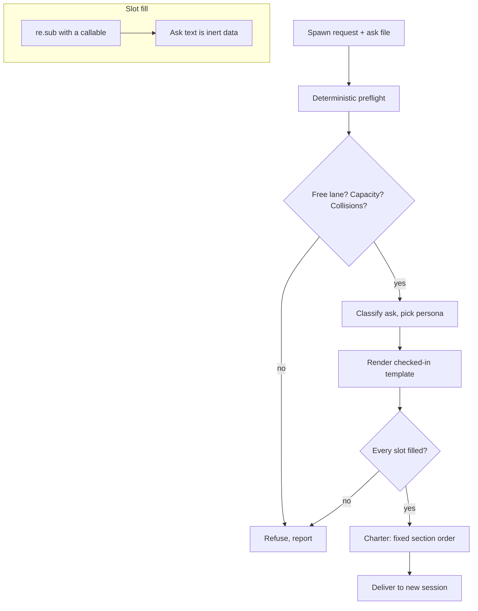

# 1. The Orientation Charter

> *Treat the opening prompt as a versioned build artifact, not a message someone types.*

Chapter 1 - Session Birth and Death · Maturity: **solid**

## The problem

A spawned agent starts cold. Hand-typed prompts vary per spawn, so sessions skip process gates,
re-derive facts that were already written down, and drift from intent. Nothing about the opening is
auditable or reproducible.

## The mechanism

The spawning parent never writes prose freehand. A deterministic preflight runs first (a fleet
health read, a free lane, a capacity and collision check), classifies the ask, selects a persona,
and then renders one checked-in template.

The renderer fills placeholder slots by regular-expression substitution with a callable, never a
format-string and never a shell, so untrusted ask text lands as inert data and can never be
interpreted as a template directive. It fails closed on any unfilled placeholder or unknown persona,
stripping the inserted ask first so that a placeholder-looking token inside the ask cannot
false-positive the check.

The template fixes the section order: identity, verbatim ask, preflight verdict, mandated first act,
scope guardrails, chain of command, persona, shutdown state. Persona text is pulled from a second
file by block tags, so the same charter carries different voices without branching the logic. The
ask travels as a file argument, never on the command line.

## Diagram

## Maturity: solid

Unit-tested and fails closed, with sample renders and a dry-run preflight committed as receipts.
Scale is the limit, not correctness: the child lane pool is small, which caps the number of
concurrent supervisors.

## Steal this

Keep one template per class of agent. Fill it from a deterministic preflight. Refuse to render on
any empty slot. Pass user text through a file, and substitute it in a way that cannot execute. Every
session then starts in the same known state, and the charter itself is diffable.

## Reference implementation

No public reference implementation yet. The running version lives in a private repo; the generic
form above is what you reproduce.
