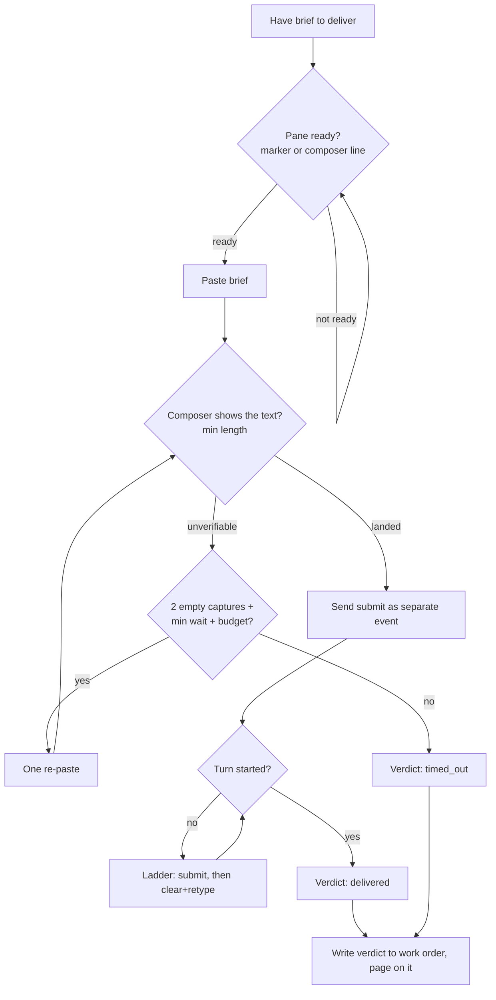

# 2. Proof-of-Delivery Paste

> *Never treat "the command exited 0" as proof a brief was delivered or submitted.*

Chapter 1 - Session Birth and Death · Maturity: **works-but-founder-scale**

## The problem

Handing a brief to a terminal-UI agent over a shared multiplexer is the most fragile hop in the
system. A sleep followed by a keystroke send fails on a booting pane, on a modal that eats the
paste, on a same-breath submit that lands as a newline, and on a slow render that hides a paste that
actually landed.

## The mechanism

Readiness is polled, not slept. Ready means a specific rendered marker or a composer line, and any
numbered-option line forces not-ready, because a menu is waiting for a different kind of input.

The paste is then verified by polling the composer for the paste chip or the prompt's own text,
normalized at a minimum character length so a short coincidence cannot pass. The verdict is one of
three states: landed, positively absent, or unverifiable. Submit is a separate key event, followed
by a submit-verify ladder: look for the turn to start, then a plain submit, then a guarded
clear-and-retype.

Exactly one re-paste is allowed, and only when two identical captures both lack the text, a minimum
wait has elapsed, and there is budget left to verify the result. The final verdict is a first-class
field on the work order (delivered, failed, timed out, or not applicable) and is paged on.

## Diagram

## Maturity: works-but-founder-scale

Openly fragile. The code comments record several live incidents, two of them caused by the fix for
the previous one: a re-paste wait that was too short doubled briefs, a longer one still doubled them,
and the current value is an honest guess. An unresolved comment flags a worst-case timing that runs
close to the liveness gate. The technique is sound; the constants are not yet settled.

## Steal this

Gate the send on evidence the surface accepts input. Gate the submit on evidence the input landed.
Make every retry evidence-gated and single-shot. Publish the delivery verdict as a first-class field
and alert on it, so a silent non-delivery becomes a visible failure.

## Reference implementation

No public reference implementation yet. The running version lives in a private repo; the generic
form above is what you reproduce.
