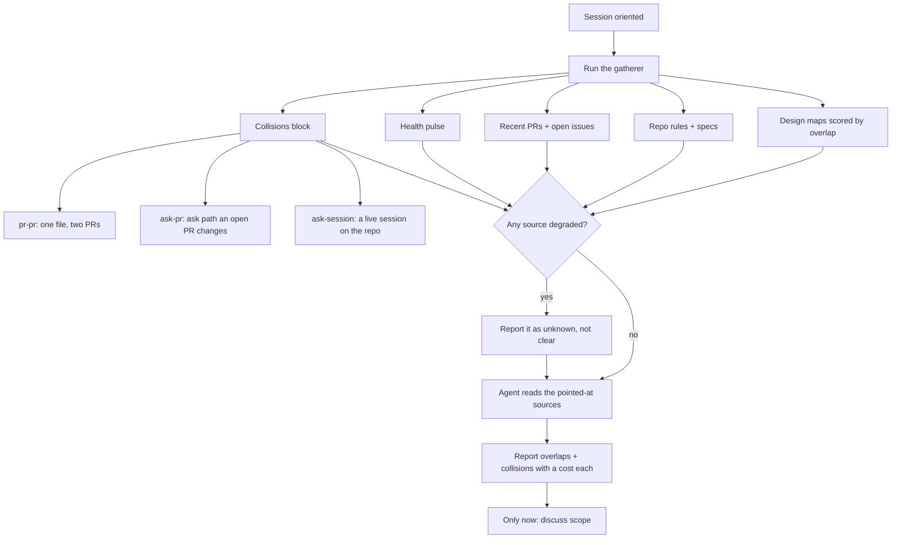

# 3. Briefing Pack First

> *Make orientation a gathered artifact, read and reported on before any scope talk.*

Chapter 1 - Session Birth and Death · Maturity: **solid**

## The problem

A freshly oriented agent's instinct is to talk about scope immediately. It then asks about facts
that were already in the design docs, misses the repo's process gates, duplicates an open issue, or
edits a file that two open pull requests and a live sibling session are already touching.

## The mechanism

The charter makes gathering the mandatory first act. A deterministic, never-raising gatherer emits
one structured pack: design maps scored by term overlap with the ask, the repo's contributor rules
and specs, recent pull requests, open issues, a health pulse, and a collisions block.

The collisions block covers three shapes: one file touched by two or more open pull requests; an ask
path that an open pull request already changes; and a live session already working the same repo. A
degraded source is reported as unknown, never as clear, so a gather that could not run is never
mistaken for a clean result.

The pack points; it does not summarize. The agent reads what the pack points at and reports before
it may discuss scope. Overlap candidates are offered with a cost attached, so nothing is folded into
the current build silently.

## Diagram

## Maturity: solid

The gatherer is deterministic and covered by tests, with a stated staleness limit: on a build that
runs longer than an hour, the collision snapshot must be re-run before each new builder is spawned,
because another agent may have started touching the same files in the meantime.

## Steal this

One deterministic command collects the design docs, the repo's rules, the open work, and the
file-level collisions with other agents and pull requests. The agent reads and reports before it may
discuss scope, and a degraded source reports unknown rather than clear.

## Reference implementation

No public reference implementation yet. The running version lives in a private repo; the generic
form above is what you reproduce.
