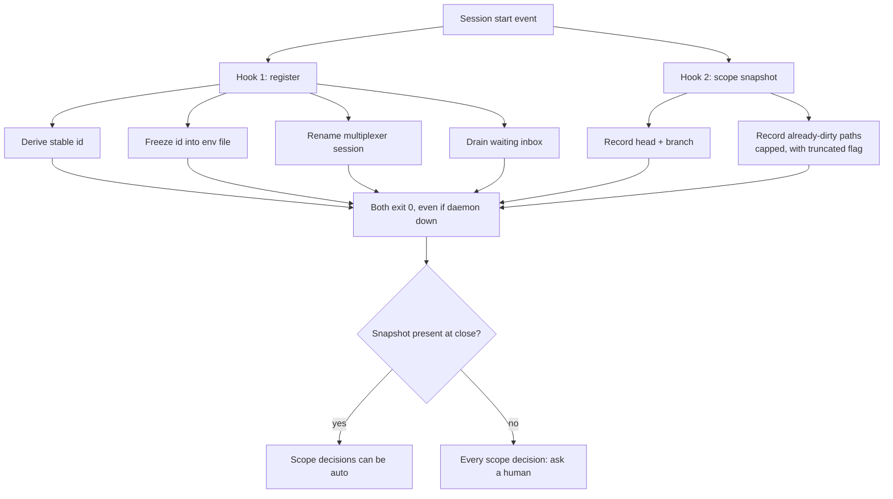

# 4. Zero-Token Hooks

> *What the opening of a session must guarantee belongs in a process hook, not in the instructions.*

Chapter 1 - Session Birth and Death · Maturity: **works-but-founder-scale**

## The problem

Guarantees left to the model cost tokens and get skipped under context pressure. Worse, some facts
are only knowable at the very start: at close time, a plain status check cannot tell work this
session did from work that was already uncommitted when the session opened.

## The mechanism

Two independent start hooks, both deterministic and both spending zero model tokens. One registers
the session: it derives a stable id, freezes it into the session's environment file, renames the
multiplexer session to match, and drains any waiting inbox. The other takes a scope snapshot: it
records the repo head, the branch, and the exact paths that were already dirty before the model
touched anything, capped at a fixed number of paths with a truncation flag, on a short time budget.

Both hooks are installed at user level, and every hook exits zero even when its backing daemon is
down, so a hook can never wedge a session at birth. Absence is safe by construction: with no
snapshot, every scope-dependent close-out decision classifies as "ask a human" rather than "auto".
Installation splices in exactly one entry and preserves every other setting.

## Diagram

## Maturity: works-but-founder-scale

The mechanism is sound and fail-safe, but its consumer has burned real work on shared checkouts,
where "already dirty at start" is a poor proxy for "not mine". A session that registers without its
hooks in place once caused a redelivery storm. The hook layer is right; the close-out logic that
reads it needs a real ownership signal, not a proxy.

## Steal this

Put identity, inbox drain, and any baseline that is only observable at the start into hooks with a
hard time budget that exit zero on every path. Make absence degrade the dependent feature to "ask a
human" rather than to a wrong answer.

## Reference implementation

No public reference implementation yet. The running version lives in a private repo; the generic
form above is what you reproduce.
