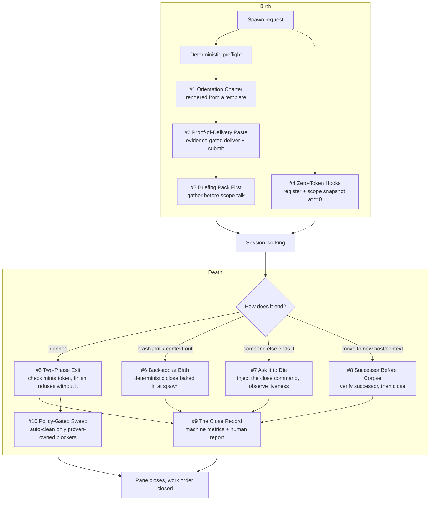

# Chapter 1 - Session Birth and Death

An agent session is a process with no supervisor, no signal handler, and state that only its own
pane can see. Those three facts make both ends dangerous: a session born wrong drifts silently, and
one that dies wrong takes uncommitted work and open bookkeeping with it.

This chapter is the clearest expression of **Evidence over Exit Codes** (Sparkry Ten #2): readiness
proven by pane content, delivery by composer content, close by re-collected blockers. It also
carries **Deterministic Mechanisms over Good Intentions** (#1) in the rendered charter and the
zero-token hooks, **Per-Build Lifetime** (#8) in respawn-over-resume, and **Scars Become Constants**
(#9) in nearly every timeout below, each one tracing back to a dated incident that created it.

## The system in one page

## Patterns in this chapter

| # | Pattern | Maturity | Status |
|---|---------|----------|--------|
| 1 | [The Orientation Charter](01-the-orientation-charter.md) | solid | published |
| 2 | [Proof-of-Delivery Paste](02-proof-of-delivery-paste.md) | works-but-founder-scale | published |
| 3 | [Briefing Pack First](03-briefing-pack-first.md) | solid | published |
| 4 | [Zero-Token Hooks](04-zero-token-hooks.md) | works-but-founder-scale | published |
| 5 | The Two-Phase Exit | solid | coming |
| 6 | Backstop at Birth | solid | coming |
| 7 | Ask It to Die | fragile | coming |
| 8 | Successor Before Corpse | works-but-founder-scale | coming |
| 9 | The Close Record | solid | coming |
| 10 | The Policy-Gated Sweep | fragile | coming |

See the full [pattern index](../../INDEX.md) for every chapter.
