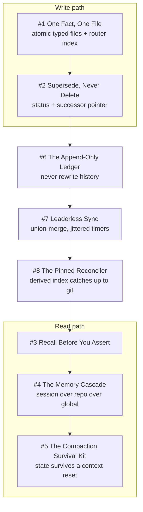

# Chapter 2 - Fleet Memory

A fleet that forgets is a fleet that repeats its own post-mortems. This chapter covers how durable knowledge is stored, retrieved, tiered, synced, and reconciled across four hosts and hundreds of short-lived sessions, without a coordinator and without loading a thousand files into every prompt. It leans hardest on **One Authority per Truth**: git holds the corpus, the semantic index is strictly derived, and one validating writer owns every entry. It also turns on **Unknown Is Never Clear**, since a superseded fact is served behind a banner and a failed peer check counts as a mismatch, never a pass. **Scars Become Constants** runs through every guard here: the jitter offsets, the union-merge policy, the pin validation, and the append-only ledger each cite the dated incident that produced them. Where the mechanism is still only prose, the entries say so, because **Deterministic Mechanisms over Good Intentions** is a standard this chapter does not yet fully meet.

## The system in one page

## Patterns in this chapter

| # | Pattern | Maturity | Status |
|---|---------|----------|--------|
| 1 | One Fact, One File | works-but-founder-scale | coming |
| 2 | Supersede, Never Delete | solid | coming |
| 3 | Recall Before You Assert | works-but-founder-scale | coming |
| 4 | The Memory Cascade | works-but-founder-scale | coming |
| 5 | The Compaction Survival Kit | solid | coming |
| 6 | The Append-Only Ledger | solid | coming |
| 7 | Leaderless Sync | works-but-founder-scale | coming |
| 8 | The Pinned Reconciler | fragile | coming |

See the full [pattern index](../../INDEX.md) for every chapter.
