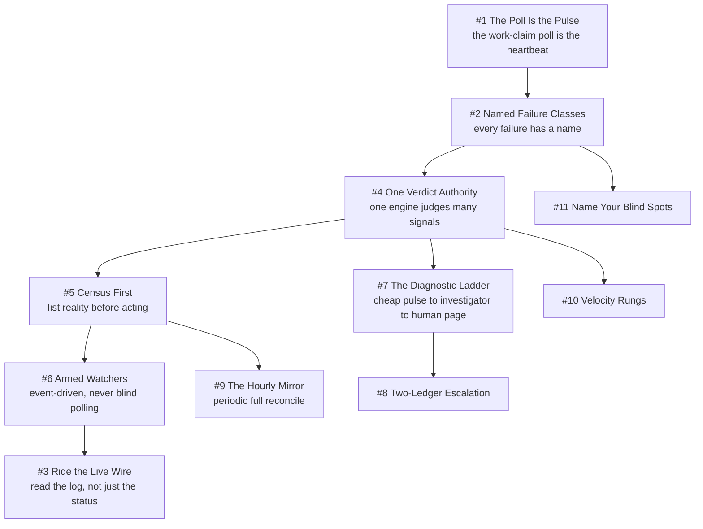

# Chapter 3 - Watching the Fleet

Watching a fleet of agent sessions is not watching servers. A session can be up, beating, and burning nothing because its brief sits unsubmitted in a composer box; a host can look dead because the one lane that happened to poll went quiet. This chapter is where the Sparkry Ten get their hardest workout: **Evidence over Exit Codes**, **Unknown Is Never Clear** (a missing key is "could not look", never "empty fleet"), **One Authority per Truth** (one verdict engine over four disagreeing stores, fenced by an epoch), and **Scars Become Constants** (every threshold below cites the incident that produced it). The last pattern is the one most monitoring docs omit: a written list of what the design structurally cannot see.

## The system in one page

## Patterns in this chapter

| # | Pattern | Maturity | Status |
|---|---------|----------|--------|
| 1 | The Poll Is the Pulse | solid | coming |
| 2 | Named Failure Classes | solid | coming |
| 3 | Ride the Live Wire | works-but-founder-scale | coming |
| 4 | One Verdict Authority | solid | coming |
| 5 | Census First | solid | coming |
| 6 | Armed Watchers | works-but-founder-scale | coming |
| 7 | The Diagnostic Ladder | solid | coming |
| 8 | Two-Ledger Escalation | solid | coming |
| 9 | The Hourly Mirror | solid | coming |
| 10 | Velocity Rungs | solid | coming |
| 11 | Name Your Blind Spots | mixed | coming |

See the full [pattern index](../../INDEX.md) for every chapter.
