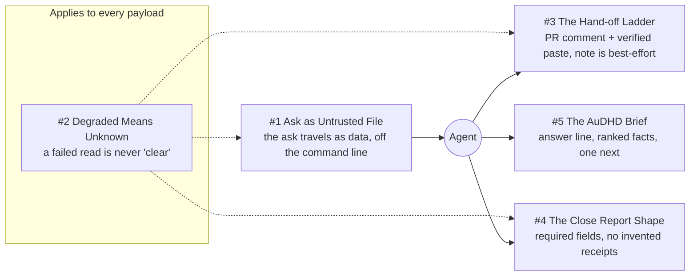

# Chapter 4 - Structured Payloads

Every boundary in this system carries a payload: a brief into a pane, a snapshot into a supervisor's first act, a state change from a child to its parent, a closing report to a human who stopped watching an hour ago. This chapter is about giving each of those a shape a machine can check and a reader can act on. It is the home of **Everything Inbound Is Data** (#5), which is why an ask travels as a file path and never as argv, and of **Unknown Is Never Clear** (#3), which is why a briefing section that could not be gathered says so in its own `ok` field. **Deterministic Mechanisms over Good Intentions** (#1) draws the dividing line running through the chapter: the payloads with linters and schemas hold, and the ones enforced by instruction text alone are marked as the conventions they are.

## The system in one page

## Patterns in this chapter

| # | Pattern | Maturity | Status |
|---|---------|----------|--------|
| 1 | Ask as Untrusted File | solid | coming |
| 2 | Degraded Means Unknown | solid | coming |
| 3 | The Hand-off Ladder | solid | coming |
| 4 | The Close Report Shape | solid | coming |
| 5 | The AuDHD Brief | mixed | coming |

See the full [pattern index](../../INDEX.md) for every chapter.
