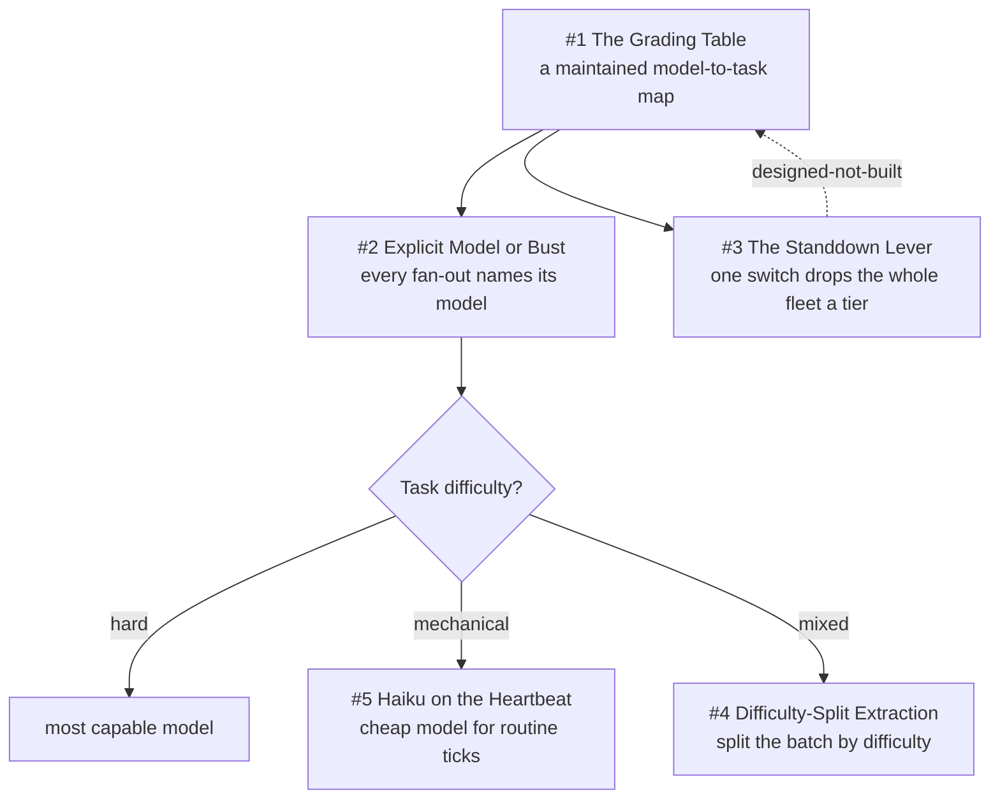

# Chapter 5 - Grading the Models

Model choice is a routing decision, not a preference. This chapter answers the question every multi-agent operator eventually gets billed for: which tier does this piece of work actually need? The patterns exemplify Sparkry Ten #1 (Deterministic Mechanisms over Good Intentions), and they are also the clearest place the fleet falls short of it: the routing table and the frontier standdown are policy text a human follows, while only the cheap-probe pin is enforced by a test. They exemplify #9 (Scars Become Constants) without qualification, since every rule cites the dated incident and the token count that created it, from the 2026-08-11 workflows that each burned over a million frontier tokens to the 2026-08-19 audit that caught a heartbeat paying frontier rates. The honest verdict: the grading judgment is good, the enforcement is thin.

## The system in one page

## Patterns in this chapter

| # | Pattern | Maturity | Status |
|---|---------|----------|--------|
| 1 | The Grading Table | solid | coming |
| 2 | Explicit Model or Bust | works-but-founder-scale | coming |
| 3 | The Standdown Lever | designed-not-built | coming |
| 4 | Difficulty-Split Extraction | works-but-founder-scale | coming |
| 5 | Haiku on the Heartbeat | solid | coming |

See the full [pattern index](../../INDEX.md) for every chapter.
