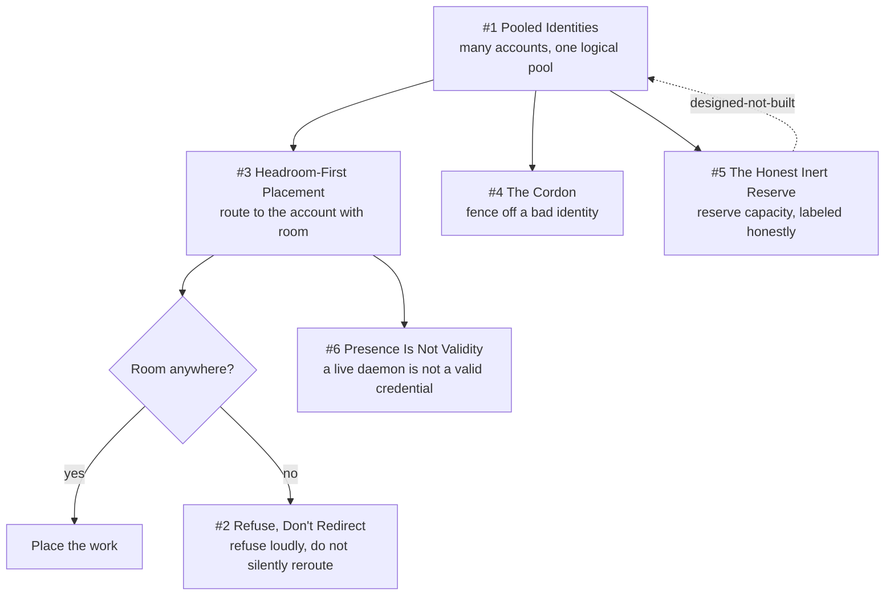

# Chapter 6 - The Quota Pool

A weekly subscription ceiling is a hard physical limit on how much autonomous work a fleet can do, so the fleet treats accounts the way a scheduler treats nodes: a pool with meters, cordons, and an admission gate. These patterns exemplify Sparkry Ten #4 (Refuse, Don't Degrade), since the placement gate returns a typed 409 rather than quietly moving a spawn elsewhere, and #6 (One Authority per Truth), since the allocator stamps its decision back onto the work order so nothing downstream re-derives it. The auth probe is the chapter's clearest case of #3 (Unknown Is Never Clear): a locked Keychain yields `inconclusive`, never a false negative. Two entries are deliberately unflattering. The 20% cockpit reserve is fully implemented and permanently off, and every account freeze that actually happened bypassed the code path built to enforce it, a failure of #1 (Deterministic Mechanisms over Good Intentions) recorded rather than hidden.

## The system in one page

## Patterns in this chapter

| # | Pattern | Maturity | Status |
|---|---------|----------|--------|
| 1 | Pooled Identities | solid | coming |
| 2 | Refuse, Don't Redirect | solid | coming |
| 3 | Headroom-First Placement | works-but-founder-scale | coming |
| 4 | The Cordon | fragile | coming |
| 5 | The Honest Inert Reserve | designed-not-built | coming |
| 6 | Presence Is Not Validity | solid | coming |

See the full [pattern index](../../INDEX.md) for every chapter.
