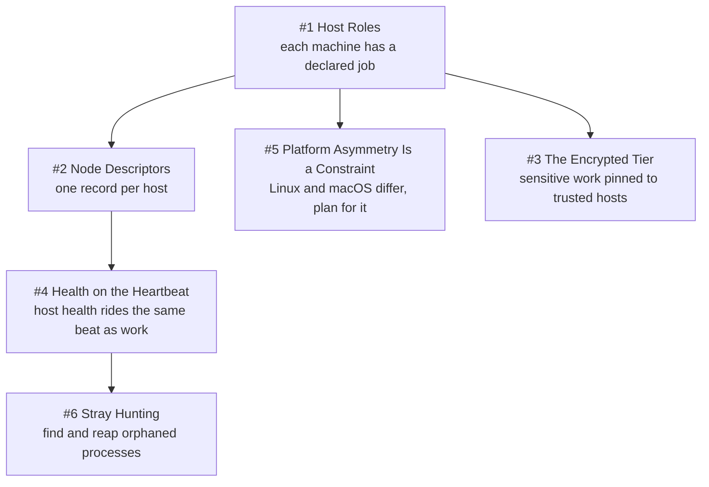

# Chapter 7 - Handling Hosts

Four machines is not a cluster, and pretending otherwise is how you saturate the wrong one. The fleet spans two OS families, three roles, and one laptop that closes its lid mid-build, so these patterns are about encoding those asymmetries as data rather than as habits. The chapter leans on **Deterministic Mechanisms over Good Intentions** (placement is a pure function over a role enum, not an operator's judgment), **Refuse, Don't Degrade** (a constraint refuses a named host outright rather than quietly relocating the work), **Unknown Is Never Clear** (a keychain that cannot be read over ssh is unknown, never a failure), and **Scars Become Constants** (a 10-minute outage produced the role map). It also carries the catalog's most uncomfortable entry: a committed descriptor asserting a path nobody has verified.

## The system in one page

## Patterns in this chapter

| # | Pattern | Maturity | Status |
|---|---------|----------|--------|
| 1 | Host Roles | solid | coming |
| 2 | Node Descriptors | fragile | coming |
| 3 | The Encrypted Tier | works-but-founder-scale | coming |
| 4 | Health on the Heartbeat | solid | coming |
| 5 | Platform Asymmetry Is a Constraint | solid | coming |
| 6 | Stray Hunting | solid | coming |

See the full [pattern index](../../INDEX.md) for every chapter.
