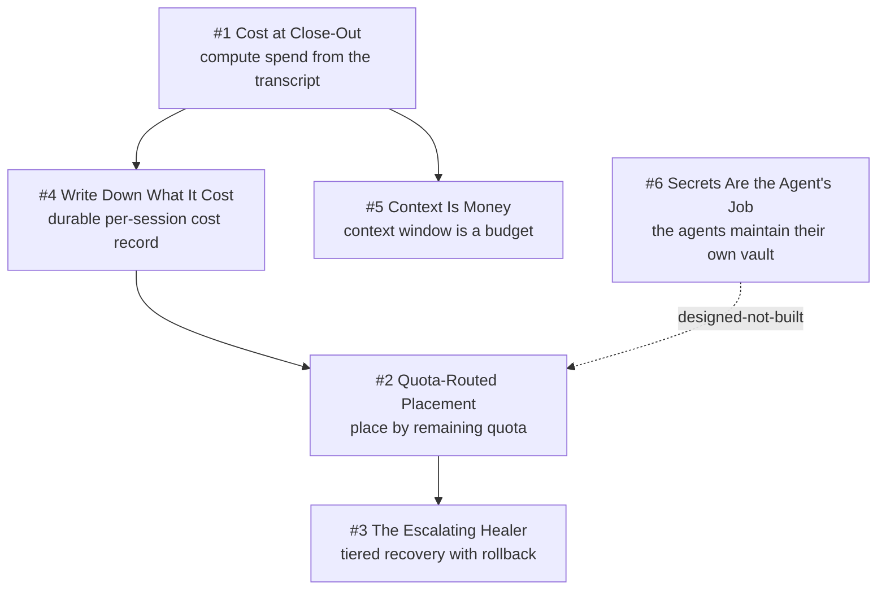

# Chapter 8 - Counting the Tokens

Tokens are the fleet's fuel, its rate limit, and its bill, and for a long time none of the three were measured. This chapter covers the accounting boundary at session death, the routing that spends quota before it runs out, the loops that scale their own spend to the difficulty of the problem, and the context discipline that keeps a long-running session affordable. It exemplifies **Unknown Is Never Clear** most directly: an unpriced model makes the whole cost estimate null rather than quietly low, and a roll-up reports costed sessions alongside total sessions. It also runs on **Refuse, Don't Degrade**, with a hard 90% quota cutoff instead of waiting for exhaustion. **Scars Become Constants** supplies the numbers: a 10-minute saturation outage on 2026-08-15 produced the cutoff, and a silently failing telemetry regex produced three duplicate bug reports in 40 minutes. Two entries here are deliberately honest about being policy rather than mechanism.

## The system in one page

## Patterns in this chapter

| # | Pattern | Maturity | Status |
|---|---------|----------|--------|
| 1 | Cost at Close-Out | works-but-founder-scale | coming |
| 2 | Quota-Routed Placement | solid | coming |
| 3 | The Escalating Healer | mixed | coming |
| 4 | Write Down What It Cost | works-but-founder-scale | coming |
| 5 | Context Is Money | mixed | coming |
| 6 | Secrets Are the Agent's Job | designed-not-built | coming |

See the full [pattern index](../../INDEX.md) for every chapter.
