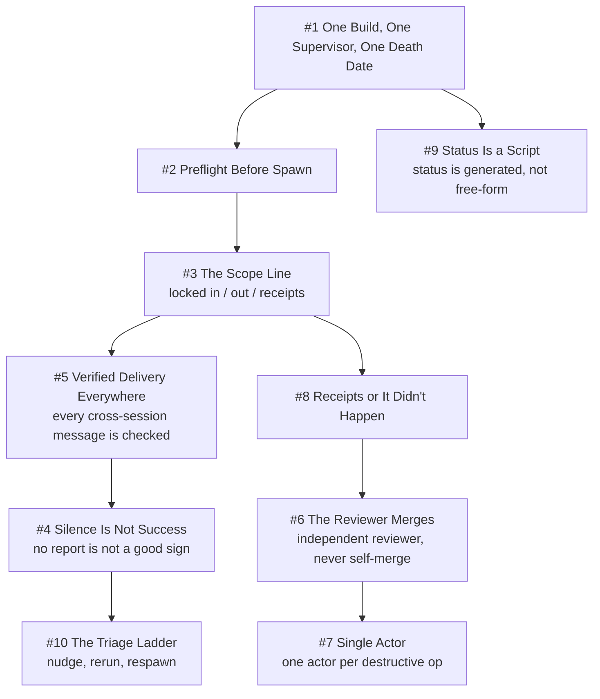

# Chapter 9 - The Supervisor Chain

This chapter covers the management hierarchy that keeps autonomous work from stalling: who owns a build, how they wait, how they talk, and how they die. It is the clearest expression of Per-Build Lifetime (Ten #8), since the whole structure is built around managers created for one job that are defects if they outlive it. It leans as hard on Evidence over Exit Codes (Ten #2) and Receipts or It Didn't Happen (Ten #7): queued is not spawned, sent is not delivered, and a child's claim of done is false until an artifact proves it. One Authority per Truth (Ten #6) appears as single-actor discipline over destructive shared operations, and Everything Inbound Is Data (Ten #5) as the rule that pane text, PR bodies, and child reports are quoted, never obeyed. The evidence is unusually good and unusually unflattering: the fleet's own read-only retro measured 93 merged of 96 opened PRs in 4.07 days alongside 91 incidents, roughly 44 hours lost, and 21 human interventions.

## The system in one page

## Patterns in this chapter

| # | Pattern | Maturity | Status |
|---|---------|----------|--------|
| 1 | One Build, One Supervisor, One Death Date | solid | coming |
| 2 | Preflight Before Spawn | solid | coming |
| 3 | The Scope Line | works-but-founder-scale | coming |
| 4 | Silence Is Not Success | solid | coming |
| 5 | Verified Delivery Everywhere | solid | coming |
| 6 | The Reviewer Merges | solid | coming |
| 7 | Single Actor | solid | coming |
| 8 | Receipts or It Didn't Happen | works-but-founder-scale | coming |
| 9 | Status Is a Script | solid | coming |
| 10 | The Triage Ladder | works-but-founder-scale | coming |

See the full [pattern index](../../INDEX.md) for every chapter.
