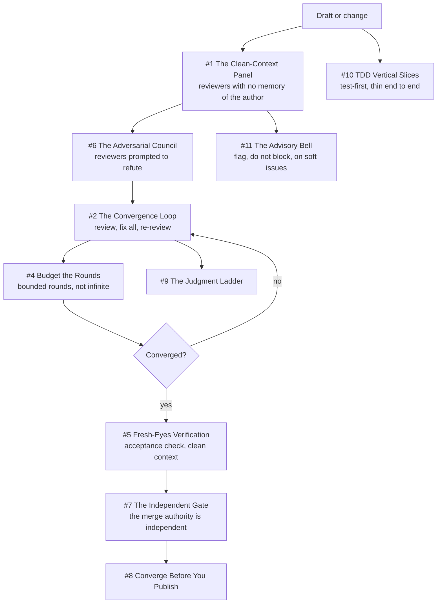

# Chapter 10 - Review and Quality

This chapter covers how work gets verified before it ships: who reviews, who decides the review is finished, and who is allowed to merge. Its spine is Deterministic Mechanisms over Good Intentions (Ten #1), because the load-bearing move throughout is putting the stopping rule, the completeness gate, and the give-up condition in code the reviewing agents cannot reason past. It also carries One Authority per Truth (Ten #6) as a single independent merge authority, Refuse Don't Degrade (Ten #4) in the fail-closed spec generator and merge gate, and Scars Become Constants (Ten #9) in guards that each cite the dated incident that created them. Two open defects are named here rather than smoothed over: a divergence between what `/qreview` claims and what its engine does, and a false-convergence hole still present in the loop code. One caveat rides on every engine pointer: the skills resolve the engine to a path absent on the drafting host, and the only readable copy is a plugin cache carrying an orphan marker, so prose contract and executing code can drift.

## The system in one page

## Patterns in this chapter

| # | Pattern | Maturity | Status |
|---|---------|----------|--------|
| 1 | The Clean-Context Panel | solid | coming |
| 2 | The Convergence Loop | works-but-founder-scale | coming |
| 3 | The Review Ledger | designed-not-built | coming |
| 4 | Budget the Rounds | works-but-founder-scale | coming |
| 5 | Fresh-Eyes Verification | solid | coming |
| 6 | The Adversarial Council | solid | coming |
| 7 | The Independent Gate | solid | coming |
| 8 | Converge Before You Publish | fragile | coming |
| 9 | The Judgment Ladder | works-but-founder-scale | coming |
| 10 | TDD Vertical Slices | works-but-founder-scale | coming |
| 11 | The Advisory Bell | solid | coming |

See the full [pattern index](../../INDEX.md) for every chapter.
