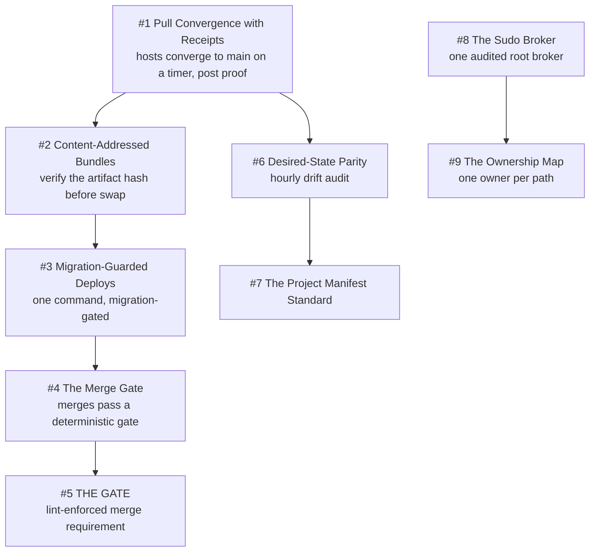

# Chapter 11 - Operating the Machine

This chapter is the fleet operating on itself: how a change to the agent infrastructure reaches the machines that run agents, and how the system proves it landed. It is the most concentrated expression of Deterministic Mechanisms over Good Intentions, because every pattern here began as a written rule someone broke and ended as a gate, a hook, a lint, or a refusal. It leans just as hard on Receipts or It Didn't Happen: a merged PR is not a deploy, and "changed" printed by the operator's own tool proved nothing for 9.5 hours on 2026-08-10. Refuse, Don't Degrade appears as an explicit per-cause fail direction in four separate guards, and One Authority per Truth as one rule engine behind two enforcement surfaces, one installer behind two transports, one validator behind one weaker exported schema. Nearly every constant here cites the dated incident that created it, which is Scars Become Constants in its purest form.

## The system in one page

## Patterns in this chapter

| # | Pattern | Maturity | Status |
|---|---------|----------|--------|
| 1 | Pull Convergence with Receipts | solid | coming |
| 2 | Content-Addressed Bundles | solid | coming |
| 3 | Migration-Guarded Deploys | solid | coming |
| 4 | The Merge Gate | works-but-founder-scale | coming |
| 5 | THE GATE | works-but-founder-scale | coming |
| 6 | Desired-State Parity | works-but-founder-scale | coming |
| 7 | The Project Manifest Standard | works-but-founder-scale | coming |
| 8 | The Sudo Broker | solid | coming |
| 9 | The Ownership Map | solid | coming |

See the full [pattern index](../../INDEX.md) for every chapter.
