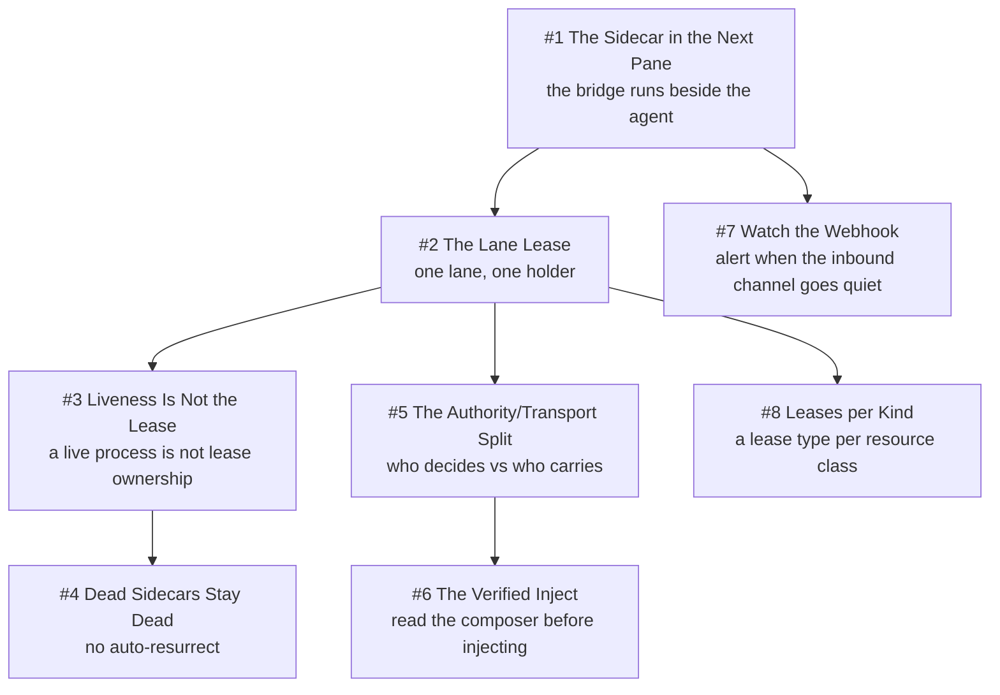

# Chapter 12 - Sidecars and Leases

An agent session running in a terminal pane has no API, so every remote channel into it is a companion process bolted on from outside, and every companion competing for a singleton chat identity needs a lease. This chapter is Evidence over Exit Codes at its sharpest: a renewed lease proves the renewer is alive and nothing more, so the guard that matters demands transcript growth after an injected message. Unknown Is Never Clear governs the edges here, where a health probe returning "could not look" skips the whole beat rather than triggering a respawn, and a blocked pane is held with a remedy rather than killed. One Authority per Truth explains why the transport moved to Redis while lease authority stayed in the dispatcher that eight independent readers already trust. Refuse, Don't Degrade shows up as a deliberate asymmetry: refusing before a side effect is free, so the injector refuses; after a non-idempotent side effect, an unverified outcome must be reported as success.

## The system in one page

## Patterns in this chapter

| # | Pattern | Maturity | Status |
|---|---------|----------|--------|
| 1 | The Sidecar in the Next Pane | solid | coming |
| 2 | The Lane Lease | solid | coming |
| 3 | Liveness Is Not the Lease | solid | coming |
| 4 | Dead Sidecars Stay Dead | works-but-founder-scale | coming |
| 5 | The Authority/Transport Split | works-but-founder-scale | coming |
| 6 | The Verified Inject | works-but-founder-scale | coming |
| 7 | Watch the Webhook | solid | coming |
| 8 | Leases per Kind | solid | coming |

See the full [pattern index](../../INDEX.md) for every chapter.
