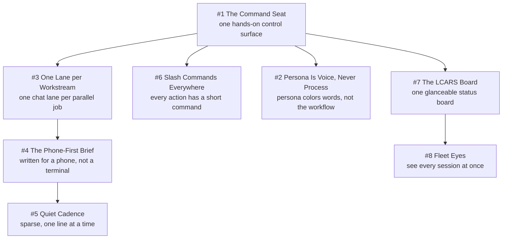

# Chapter 13 - The Operator Experience

A fleet that ships software autonomously still has exactly one human in the loop, and that human reads most of it on a phone, mid-task, interrupted. This chapter covers the surfaces that human touches: the command seat, the chat lanes, the console, and the briefs. It leans hardest on Deterministic Mechanisms over Good Intentions (a rendering contract built as pure functions plus a linter beats "format it nicely"), Unknown Is Never Clear (liveness is `live`, `gone`, or `unknown`, never guessed), Refuse, Don't Degrade (a fourth concurrent build supervisor is refused, not queued silently), Everything Inbound Is Data (payload strings are quoted, never obeyed), and One Authority per Truth (every console write rides the same work-order queue the CLI uses). The running caveat: about half of these patterns are prompt-level policy re-read by a model each session rather than code with tests, and the entries say which.

## The system in one page

## Patterns in this chapter

| # | Pattern | Maturity | Status |
|---|---------|----------|--------|
| 1 | The Command Seat | solid | coming |
| 2 | Persona Is Voice, Never Process | mixed | coming |
| 3 | One Lane per Workstream | solid | coming |
| 4 | The Phone-First Brief | solid | coming |
| 5 | Quiet Cadence | solid | coming |
| 6 | Slash Commands Everywhere | works-but-founder-scale | coming |
| 7 | The LCARS Board | solid | coming |
| 8 | Fleet Eyes | solid | coming |

See the full [pattern index](../../INDEX.md) for every chapter.
