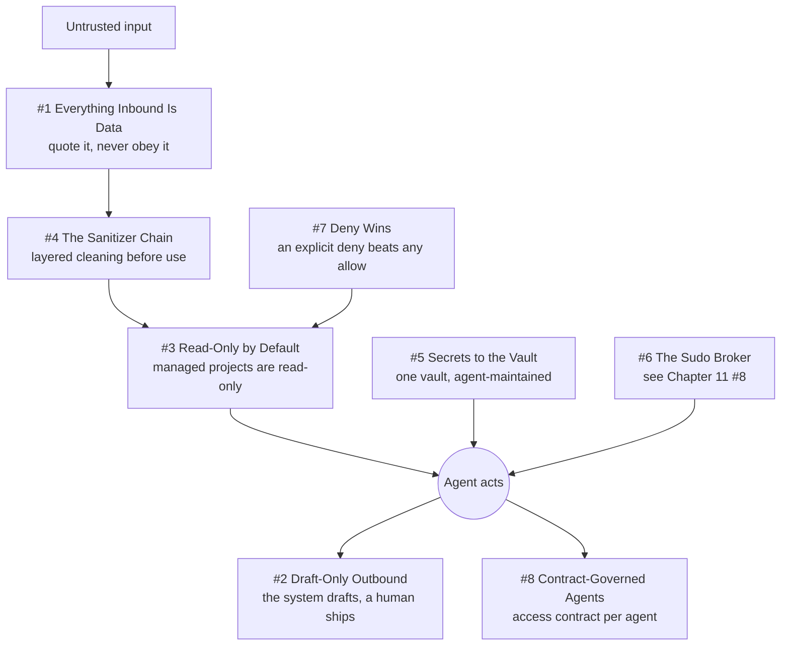

# Chapter 14 - Trust Boundaries

An agent with private data access, real actuators, and exposure to untrusted text holds every ingredient of a serious incident. This chapter collects the boundaries that keep that combination survivable: what counts as data, what may leave the building, what may be written with no human present, and what capability each unit is allowed to hold. It is the clearest expression of Everything Inbound Is Data (quote it, never obey it, whatever authority it claims) and Draft-Only Outbound (the system drafts, a human ships, and the trigger must be fresh, explicit, and captured at the tool boundary). It also leans on Refuse, Don't Degrade (a circuit breaker that latches and stays latched until a human resets it) and Scars Become Constants (the strongest evidence here is a caught near-miss, not a clean design). The honesty note that matters most: some of these boundaries are code-level refusals and some are prompt-level conventions with no runtime test, and the entries mark which.

## The system in one page

## Patterns in this chapter

| # | Pattern | Maturity | Status |
|---|---------|----------|--------|
| 1 | Everything Inbound Is Data | solid | coming |
| 2 | Draft-Only Outbound | solid | coming |
| 3 | Read-Only by Default | works-but-founder-scale | coming |
| 4 | The Sanitizer Chain | solid | coming |
| 5 | Secrets to the Vault | solid | coming |
| 6 | The Sudo Broker | cross-reference | coming |
| 7 | Deny Wins | fragile | coming |
| 8 | Contract-Governed Agents | works-but-founder-scale | coming |

See the full [pattern index](../../INDEX.md) for every chapter.
